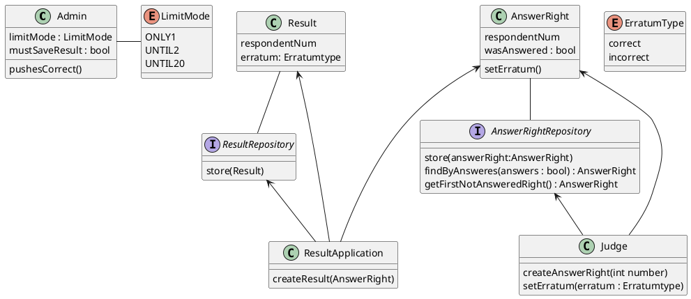

```plantuml
@startuml
  class Admin{
    limitMode : LimitMode
    mustSaveResult : bool

    pushesCorrect()
  }
  enum LimitMode{
    ONLY1
    UNTIL2
    UNTIL20
  }
  Admin - LimitMode
  class AnswerRight{
    respondentNum
    setErratum()
    wasAnswered : bool
  }
  interface AnswerRightRepository{
    store(answerRight:AnswerRight)
    findByAnsweres(answers : bool) : AnswerRight
    getFirstNotAnsweredRight() : AnswerRight
  }

  class Judge{
    createAnswerRight(int number)
    setErratum(erratum : Erratumtype)
  }

AnswerRight <--- Judge
AnswerRightRepository <-- Judge
AnswerRight -- AnswerRightRepository

  class Result{
    respondentNum
    erratum: Erratumtype
  }

  class ResultApplication{
    createResult(AnswerRight)
  }

  Interface ResultRepository{
    store(Result)
  }

  Result <--- ResultApplication
  Result - ResultRepository
  ResultRepository <- ResultApplication
  AnswerRight <--- ResultApplication

  enum ErratumType{
    correct
    incorrect
  }


@enduml
```
